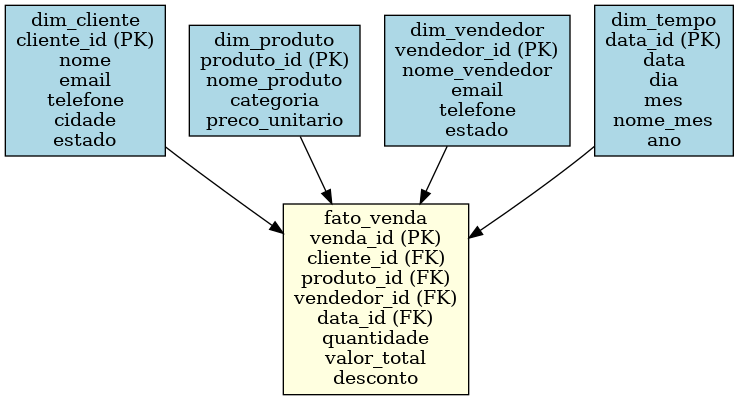

# 📊 Projeto de Análise de Vendas com SQL Server

Este projeto simula um cenário de vendas em um ambiente de banco de dados relacional utilizando SQL Server. A proposta é praticar modelagem de dados, criação de banco, inserção de dados e consultas analíticas utilizando SQL puro.

---

## 🧩 Modelagem de Dados

O modelo utilizado segue a arquitetura em estrela (Star Schema), com a tabela fato `fato_venda` conectando-se a quatro tabelas dimensão:

- `dim_cliente`
- `dim_produto`
- `dim_vendedor`
- `dim_tempo`

---

## 🛠️ Tecnologias Utilizadas

- SQL Server
- Linguagem SQL (DDL e DML)
- Diagrama de entidade-relacionamento (ER)
- Power BI (opcional para futuras análises visuais)
- Git e GitHub

---

## 📁 Estrutura de Arquivos

- `script_modelagem.sql` → Script de criação das tabelas (DDL)  
- `inserts_tabelas.sql` → Script com dados simulados para testes (DML)  
- `consultas_analise.sql` → Conjunto de consultas SQL para análise dos dados  
- `modelo_estrela_vendas.png` → Diagrama do modelo estrela utilizado  

---

## ▶️ Como Executar

1. Execute o script `script_modelagem.sql` para criar as tabelas no SQL Server.
2. Execute o script `inserts_tabelas.sql` para popular o banco com dados simulados.
3. Utilize o script `consultas_analise.sql` para realizar análises exploratórias.

---

## 🔍 Consultas de Análise Incluídas

- Total de vendas por mês
- Produto mais vendido
- Vendas por vendedor
- Vendas por estado
- Top clientes por valor gasto

---

## 👤 Autor

**Diego Mascarenhas Moreira**  
Analista de Dados | Em transição de carreira  
📧 diego86mmoreira@  
🔗 [LinkedIn](https://www.linkedin.com/in/eira-analista-dados)

---

Este projeto faz parte do meu portfólio. Fique à vontade para explorar, sugerir melhorias ou entrar em contato!
