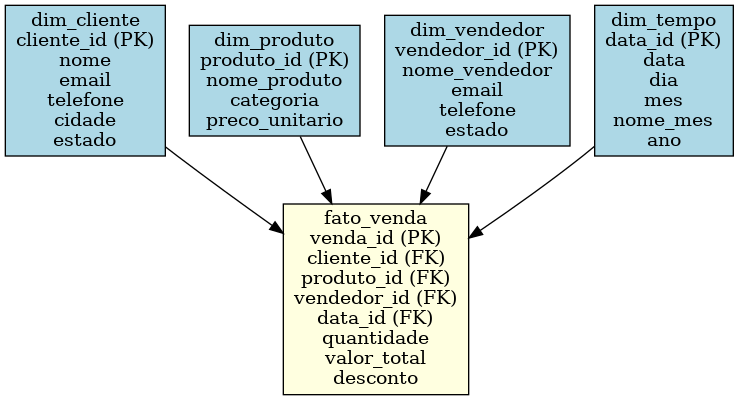

# 📊 Projeto de Análise de Vendas com SQL Server

Este projeto simula um cenário de vendas em um ambiente de banco de dados relacional utilizando **SQL Server**. O objetivo é praticar modelagem de dados, criação de banco, inserção de dados e consultas analíticas com SQL puro.

---

## 🧩 Modelagem de Dados

A estrutura segue o padrão de **modelo estrela (Star Schema)**, com a tabela fato `fato_venda` conectando-se às seguintes tabelas dimensão:

- 📌 `dim_cliente`
- 📦 `dim_produto`
- 🧑‍💼 `dim_vendedor`
- 🗓 `dim_tempo`

<p align="center">
  
</p>

---

## 🛠 Tecnologias Utilizadas

- SQL Server
- Linguagem SQL (DDL e DML)
- Power BI (opcional para futuras análises visuais)
- Git e GitHub

---

## 📁 Estrutura do Repositório

```bash
📦 projeto-analise-vendas-sqlserver
├── 📂 imagens
│   └── modelo_estrela_vendas.png
├── 📂 scripts-sql
│   ├── script_modelagem.sql
│   ├── inserts_tabelas.sql
│   └── consultas_analise.sql
└── README.md
